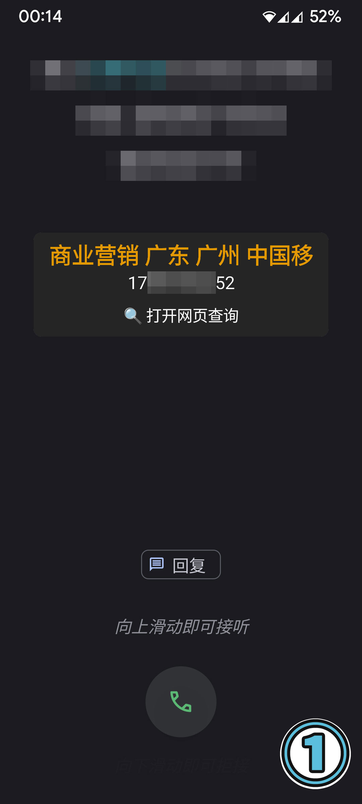
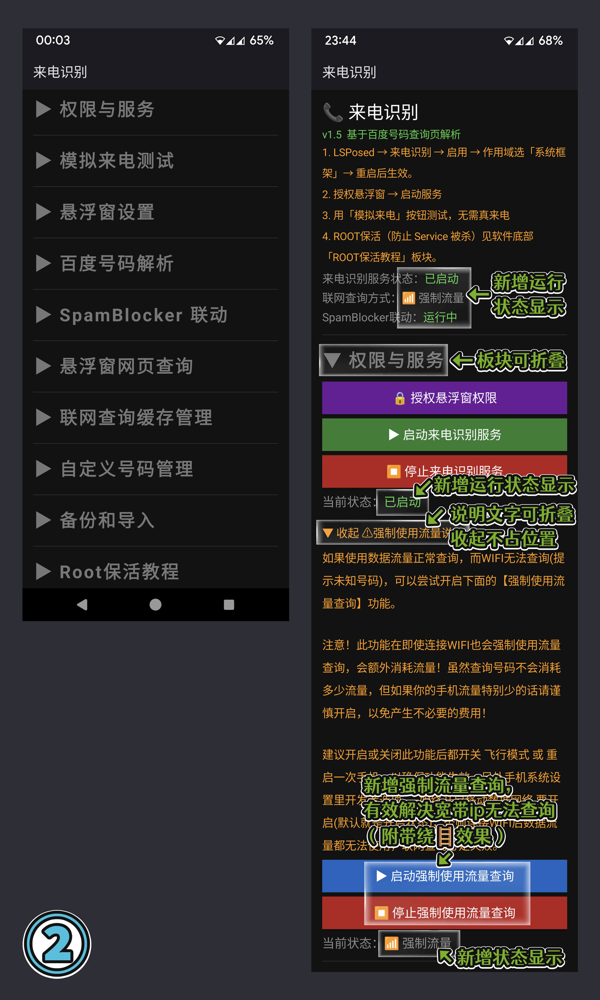
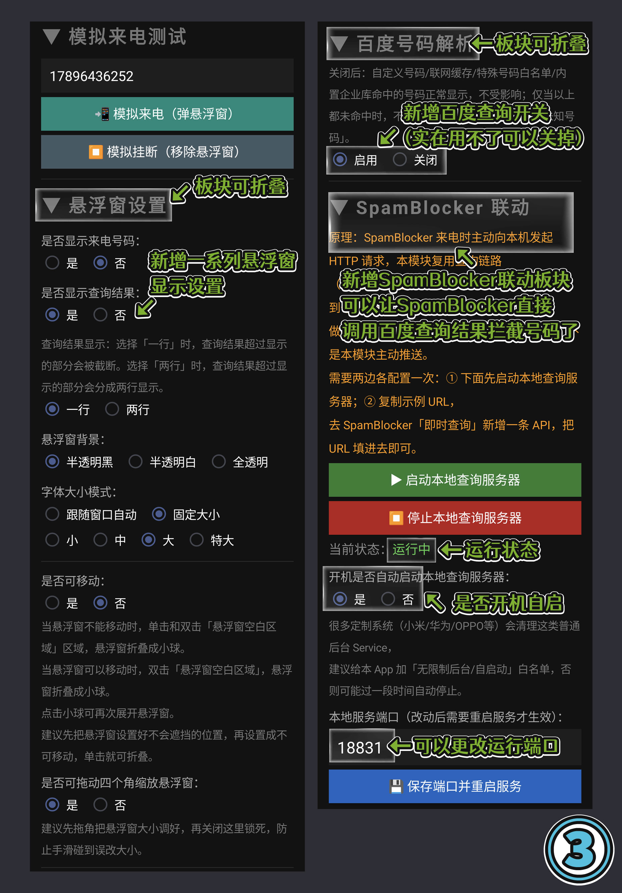
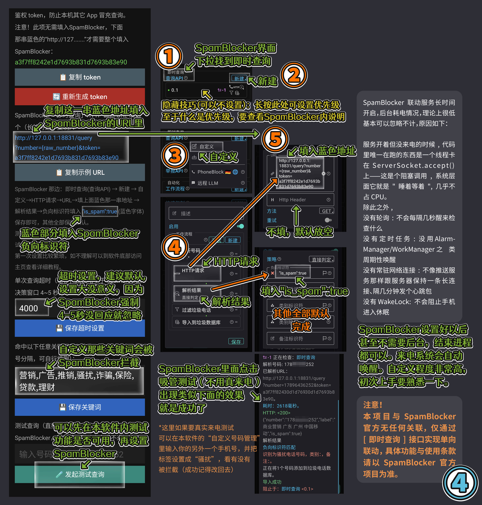
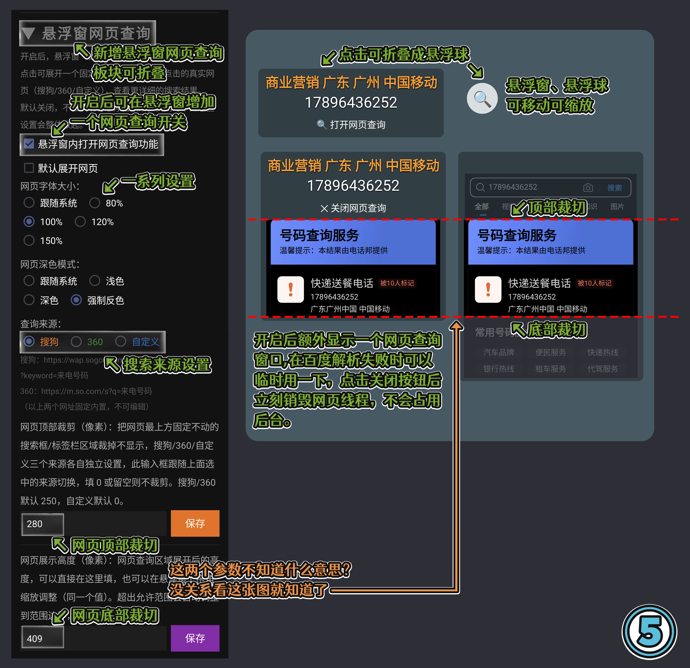
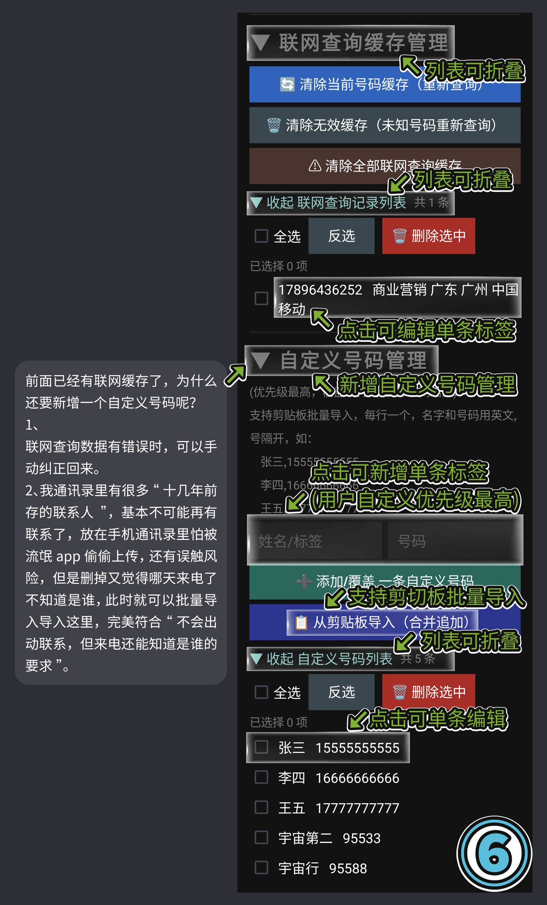
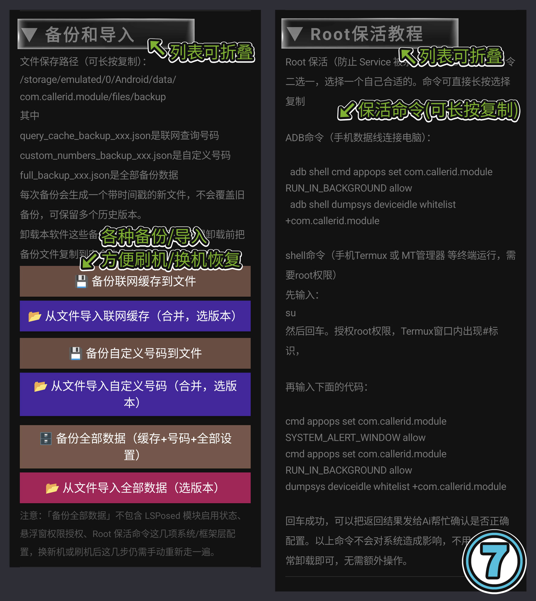

# 📞 来电识别/拦截 v1.5 | 免费开源 LSPosed 模块

## 基于酷安 @he007209 大佬分享的源码二次修改，新增多项功能，并实现联动SpamBlocker实现骚扰电话拦截。

来电前先知道对方是谁 —— 无需 API Key，纯网页解析驱动

厌倦了接起陌生电话才发现是骚扰？这个模块基于百度号码查询页解析，来电时自动弹出悬浮窗，归属地、骚扰标记、企业名称一目了然，让你先看清再决定接不接。

## 核心亮点：
🔹 悬浮窗自动弹出，无需手动查询
🔹 内置企业/机构号码库，常见号码本地秒回，不耗流量
🔹 自定义号码标注，朋友快递外卖优先显示
🔹 支持 SpamBlocker 联动，本地查询服务器一键搭建
🔹 悬浮窗样式随心定制：背景、字号、位置、大小全都可以调
🔹 内置模拟来电测试，配置对不对一测便知
🔹 支持数据备份导入，换机不丢配置

## 适用场景： 没有自带来电显示的类原生系统，骚扰电话多、想知道陌生来电身份、又不想装一堆重量级 App 的机友。

## 使用门槛： 需要 LSPosed 环境 + 悬浮窗权限，模块内附完整上手指引和 ROOT 保活教程，跟着操作即可。

## 具体操作细节直接看图片里的介绍。

本修改模块仅在作者本人刷入 PixelExperience Android 13 系统的红米 K40S 和红米 K30 5G 设备上测试成功，不保证在其他设备、系统版本或环境下的兼容性与稳定性。 安装模块存在极高风险，可能导致设备出现无限重启、卡屏死机、系统损坏（变砖）乃至硬件受损。在尝试安装前，请务必提前备份好个人所有重要数据。 如果您缺乏刷机救砖经验，或不知道如何在系统崩溃时进行自救，请绝对不要尝试刷入。 一旦您选择安装本模块，即视为您已完全理解并自愿接受上述所有风险，由此产生的数据丢失、设备损坏等一切后果均由您本人自行承担。
